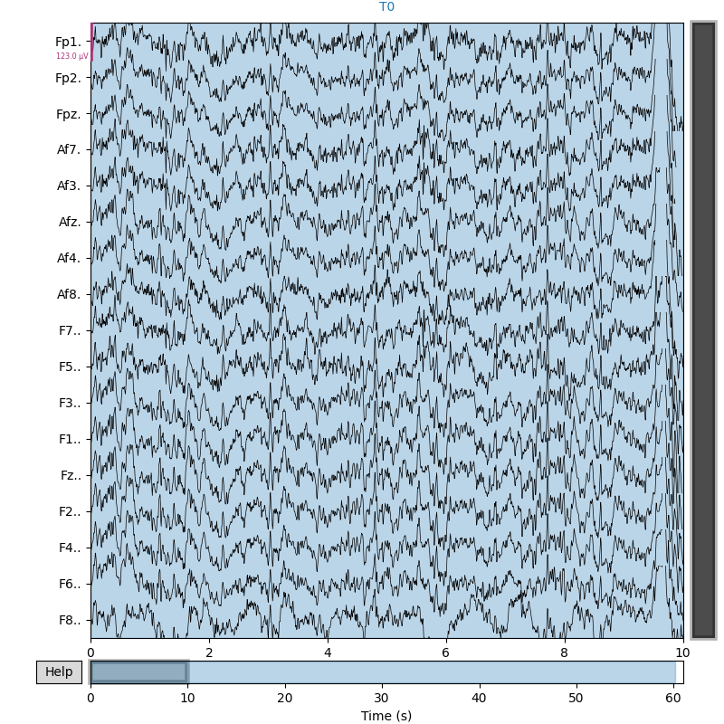
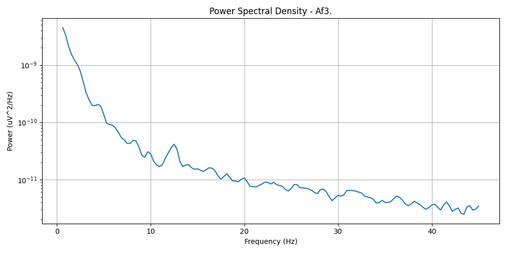

# Arduino Set-up
- Arduino R4 WiFi Board
- Download Arduino IDE for laptop OS
- Open Arduino IDE
- Download Arduino UNO R4 board in "Boards Manager" section of Arduino IDE

# Data Storage
- Open a blank Google Sheet
- Two headers to start (time, value)
- Extensions > Apps Script
- Paste in code to code.gs from *TBA to this repo*
- Deploy > New Deployment
  - Execute as: Me
  - Who has access: Anyone (necessary for Arduino)

# Arduino Code
- Tools > Board > Arduino UNO R4 > Arduino UNO R4 WiFi
- Tools > Port > *whichever says (Arduino UNO R4 WiFI next to it)*
- File > Examples > WiFiS3 > ConnectWithWPA
- Populate your WiFi address and password into arduino_secrets.h
- Click the check mark in top left
- Click the arrow in the top left
- Replace the ConnectWithWPA.ino code with the following: *TBA to this repo*
- Download "ArduinoHttpClient" in "Library Manager" section of Arduino IDE
- Click the check mark in the top left
- Click the arrow in the top left

# Integration and pipeline test
- In Google Apps Script
  - Copy the deployment ID
- In Arduino IDE
  - Paste deploymentID into line 11 of ConnectWithWPA.ipo
  - Tools > Serial Monitor
  - Select "9600 baud" in the drop down menu

---

## Video Preview

---

# EEG processing
1. Clone and open repo.
2. Create and activate virtual environment.
3. python3 -m venv .venv
   - source .venv/bin/activate
4. Install requirements
   - pip install -r requirements.txt
5. run eeg_raw_to_csv.py to get raw data into readable format
6. run eeg_raw_plotter.py to see raw data visualizesd
7. run eef_band_power_analyzer to see PWD and observe brainwaves
8. run eeg_state_proxy.py to quantify brainwaves and create proxies for different states

---

## Data Source and Channel Selection

The example data shown below is from a single subject performing the 'eyes open' baseline task, using 64 EEG channels sampled at 160 Hz. The data is sourced from the [EEG Motor Movement/Imagery Dataset on PhysioNet](https://www.physionet.org/content/eegmmidb/1.0.0/). This dataset is widely used for brain-computer interface research and provides high-quality, annotated EEG recordings.

**Channel Selection Rationale:**
We focus on frontal and prefrontal channels (Fp1, Fp2, Fpz, Af7, Af3, Afz, Af4, Af8, F7, F5, F3, F1, Fz, F2, F4, F6, F8) primarily because these regions are easily accessed with adhesive electrodes for people with hair. Additionally, these channels are highly relevant for cognitive and affective state analysis, including attention, arousal, and executive function. They are commonly used in neurofeedback and BCI research for their sensitivity to changes in mental state.

---

## Example Outputs and Interpretations

### Raw EEG Montage Example

*Interpretation: This plot shows the raw EEG signals across all channels over time. The rhythmic patterns and amplitude differences reflect underlying brain activity and electrode placement.*

### Power Spectral Density (PSD) - Af3

*Interpretation: The PSD plot for channel Af3 shows the distribution of power across frequencies. Higher power in lower frequencies (delta/theta) is typical for resting-state EEG.*

### Band Powers Table
| Channel | Delta | Theta | Alpha | Beta | Gamma |
|---------|-------|-------|-------|------|-------|
| Fp1.    | 5.46e-09 | 4.24e-10 | 1.03e-10 | 1.83e-10 | 7.99e-11 |
| Fp2.    | 5.06e-09 | 3.14e-10 | 8.94e-11 | 1.38e-10 | 3.79e-11 |
| Fpz.    | 4.32e-09 | 3.15e-10 | 9.07e-11 | 1.43e-10 | 3.64e-11 |
| Af7.    | 4.41e-09 | 4.03e-10 | 1.06e-10 | 2.03e-10 | 6.52e-11 |
| Af3.    | 4.18e-09 | 3.80e-10 | 1.03e-10 | 1.98e-10 | 6.20e-11 |
| Afz.    | 2.09e-09 | 2.79e-10 | 1.06e-10 | 1.91e-10 | 3.09e-11 |
| Af4.    | 2.56e-09 | 2.31e-10 | 8.97e-11 | 1.54e-10 | 2.82e-11 |
| Af8.    | 4.42e-09 | 2.61e-10 | 7.91e-11 | 1.41e-10 | 5.22e-11 |
| F7..    | 1.93e-09 | 2.53e-10 | 9.25e-11 | 1.92e-10 | 5.19e-11 |
| F5..    | 2.17e-09 | 2.99e-10 | 1.16e-10 | 2.35e-10 | 5.61e-11 |
| F3..    | 1.58e-09 | 2.52e-10 | 9.76e-11 | 1.87e-10 | 2.79e-11 |
| F1..    | 1.60e-09 | 3.01e-10 | 1.20e-10 | 2.36e-10 | 3.46e-11 |
| Fz..    | 1.56e-09 | 3.03e-10 | 1.18e-10 | 2.26e-10 | 3.29e-11 |
| F2..    | 1.51e-09 | 2.62e-10 | 1.06e-10 | 2.03e-10 | 3.00e-11 |
| F4..    | 1.42e-09 | 2.33e-10 | 9.61e-11 | 1.82e-10 | 2.72e-11 |
| F6..    | 1.45e-09 | 1.82e-10 | 7.79e-11 | 1.53e-10 | 2.99e-11 |
| F8..    | 2.04e-09 | 1.74e-10 | 6.03e-11 | 1.10e-10 | 3.33e-11 |
*Interpretation: This table summarizes the average power in each frequency band for all channels. Delta and theta bands dominate, as expected in typical EEG.*

### State Proxies Table
| Channel | Fear_BetaAlpha | Flow_ThetaAlpha |
|---------|----------------|-----------------|
| Fp1.    | 1.78           | 4.12            |
| Fp2.    | 1.54           | 3.51            |
| Fpz.    | 1.58           | 3.47            |
| Af7.    | 1.92           | 3.80            |
| Af3.    | 1.92           | 3.69            |
| Afz.    | 1.80           | 2.63            |
| Af4.    | 1.72           | 2.58            |
| Af8.    | 1.78           | 3.30            |
| F7..    | 2.08           | 2.74            |
| F5..    | 2.03           | 2.58            |
| F3..    | 1.92           | 2.58            |
| F1..    | 1.97           | 2.51            |
| Fz..    | 1.92           | 2.57            |
| F2..    | 1.92           | 2.47            |
| F4..    | 1.89           | 2.42            |
| F6..    | 1.96           | 2.34            |
| F8..    | 1.82           | 2.89            |
*Interpretation: These proxies estimate cognitive states. Higher Flow_ThetaAlpha values may indicate increased flow state, while higher Fear_BetaAlpha may relate to arousal or anxiety.*

# FUTURE APPLICATIONS
TBD
